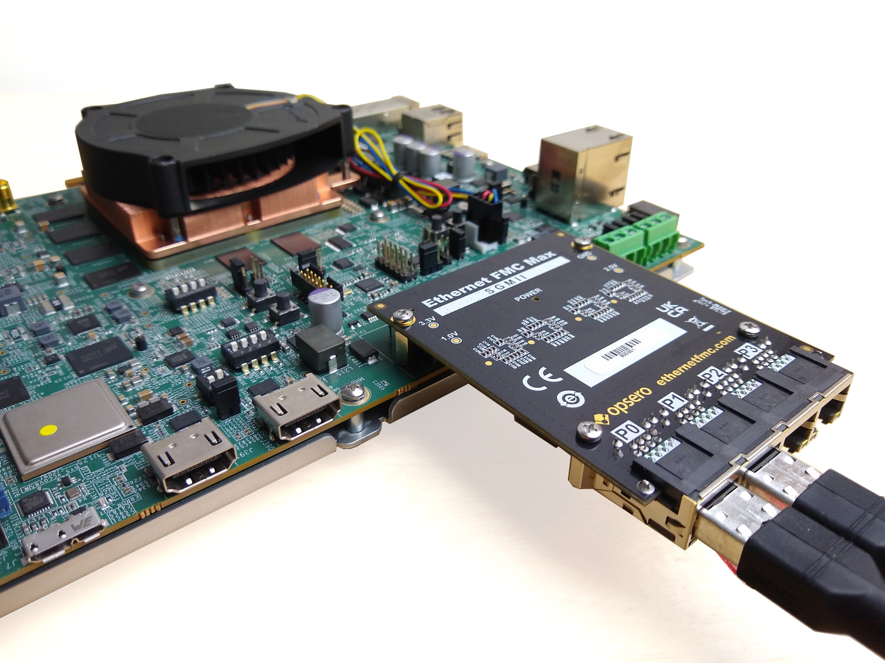

# AXI 1G Ethernet Reference Designs for Ethernet FMC Max

## Description

This project demonstrates the use of the Opsero [Ethernet FMC Max] and it supports
several development boards for UltraScale FPGA, Zynq UltraScale+ and Versal ACAP. 
The design contains 4 AXI 1G Ethernet Subsystem blocks configured with DMAs.



Important links:

* The user guide for these reference designs is hosted here: [AXI Ethernet for Ethernet FMC Max docs](https://axieth-sgmii.ethernetfmc.com "AXI Ethernet for Ethernet FMC Max docs")
* To report a bug: [Report an issue](https://github.com/fpgadeveloper/ethernet-fmc-max-axi-eth/issues "Report an issue").
* For technical support: [Contact Opsero](https://opsero.com/contact-us "Contact Opsero").
* To purchase the mezzanine card: [Ethernet FMC Max order page](https://opsero.com/product/ethernet-fmc-max "Ethernet FMC Max order page").

## Requirements

This project is designed for version 2024.1 of the Xilinx tools (Vivado/Vitis/PetaLinux). 
If you are using an older version of the Xilinx tools, then refer to the 
[release tags](https://github.com/fpgadeveloper/ethernet-fmc-max-axi-eth/tags "releases")
to find the version of this repository that matches your version of the tools.

In order to test this design on hardware, you will need the following:

* Vivado 2024.1
* Vitis 2024.1
* PetaLinux Tools 2024.1
* [Ethernet FMC Max]
* One of the target platforms listed below
* [Xilinx Soft TEMAC license](https://ethernetfmc.com/getting-a-license-for-the-xilinx-tri-mode-ethernet-mac/ "Xilinx Soft TEMAC license")

## Target designs

This repo contains several designs that target various supported development boards and their
FMC connectors. The table below lists the target design name, the number of ports supported by the design and 
the FMC connector on which to connect the Ethernet FMC Max. Some of the target designs
require a license to generate a bitstream with the AMD Xilinx tools.

<!-- updater start -->
### Zynq UltraScale+ designs

| Target board          | Target design      | Ports       | FMC Slot    | Standalone<br> Echo Server | PetaLinux | Vivado<br> Edition |
|-----------------------|--------------------|-------------|-------------|-------|-------|-------|
| [UltraZed-EV Carrier] | `uzev`             | 4x          | HPC         | :white_check_mark: | :white_check_mark: | Standard :free: |
| [ZCU102]              | `zcu102_hpc0`      | 4x          | HPC0        | :white_check_mark: | :white_check_mark: | Enterprise |
| [ZCU102]              | `zcu102_hpc1`      | 4x          | HPC1        | :white_check_mark: | :white_check_mark: | Enterprise |
| [ZCU104]              | `zcu104`           | 1x          | LPC         | :white_check_mark: | :white_check_mark: | Standard :free: |
| [ZCU106]              | `zcu106_hpc0`      | 4x          | HPC0        | :white_check_mark: | :white_check_mark: | Standard :free: |
| [ZCU111]              | `zcu111`           | 4x          | FMCP        | :white_check_mark: | :white_check_mark: | Enterprise |
| [ZCU208]              | `zcu208`           | 4x          | FMCP        | :white_check_mark: | :white_check_mark: | Enterprise |
| [ZCU216]              | `zcu216`           | 4x          | FMCP        | :white_check_mark: | :white_check_mark: | Enterprise |

### Versal designs

| Target board          | Target design      | Ports       | FMC Slot    | Standalone<br> Echo Server | PetaLinux | Vivado<br> Edition |
|-----------------------|--------------------|-------------|-------------|-------|-------|-------|
| [VCK190]              | `vck190_fmcp1`     | 4x          | FMCP1       | :white_check_mark: | :white_check_mark: | Enterprise |
| [VCK190]              | `vck190_fmcp2`     | 4x          | FMCP2       | :white_check_mark: | :white_check_mark: | Enterprise |
| [VEK280]              | `vek280`           | 4x          | FMCP        | :white_check_mark: | :white_check_mark: | Enterprise |
| [VHK158]              | `vhk158`           | 4x          | FMCP        | :white_check_mark: | :white_check_mark: | Enterprise |
| [VMK180]              | `vmk180_fmcp1`     | 4x          | FMCP1       | :white_check_mark: | :white_check_mark: | Enterprise |
| [VMK180]              | `vmk180_fmcp2`     | 4x          | FMCP2       | :white_check_mark: | :white_check_mark: | Enterprise |
| [VPK120]              | `vpk120`           | 4x          | FMCP        | :white_check_mark: | :white_check_mark: | Enterprise |
| [VPK180]              | `vpk180`           | 4x          | FMCP        | :white_check_mark: | :white_check_mark: | Enterprise |

[UltraZed-EV Carrier]: https://www.xilinx.com/products/boards-and-kits/1-1s78dxb.html
[ZCU102]: https://www.xilinx.com/zcu102
[ZCU104]: https://www.xilinx.com/zcu104
[ZCU106]: https://www.xilinx.com/zcu106
[ZCU111]: https://www.xilinx.com/zcu111
[ZCU208]: https://www.xilinx.com/zcu208
[ZCU216]: https://www.xilinx.com/zcu216
[VCK190]: https://www.xilinx.com/vck190
[VEK280]: https://www.xilinx.com/vek280
[VHK158]: https://www.xilinx.com/vhk158
[VMK180]: https://www.xilinx.com/vmk180
[VPK120]: https://www.xilinx.com/vpk120
[VPK180]: https://www.xilinx.com/vpk180
<!-- updater end -->

Notes:

1. The Vivado Edition column indicates which designs are supported by the Vivado *Standard* Edition, the
   FREE edition which can be used without a license. Vivado *Enterprise* Edition requires
   a license however a 30-day evaluation license is available from the AMD Xilinx Licensing site.

## Software

These reference designs can be driven by either a standalone application or within a PetaLinux environment. 
The repository includes all necessary scripts and code to build both environments. The table 
below outlines the corresponding applications available in each environment:

| Environment      | Available Applications  |
|------------------|-------------------------|
| Standalone       | lwIP Echo Server |
| PetaLinux        | Built-in Linux commands<br>Additional tools: ethtool, phytool, iperf3 |

## Build instructions

Clone the repo:
```
git clone https://github.com/fpgadeveloper/ethernet-fmc-max-axi-eth.git
```

Source Vivado and PetaLinux tools:

```
source <path-to-petalinux>/2024.1/settings.sh
source <path-to-vivado>/2024.1/settings64.sh
```

To build the standalone lwIP echo server application (Vivado project and Vitis workspace):

```
cd ethernet-fmc-max-axi-eth/Vitis
make workspace TARGET=zcu106_hpc0
```

To build the PetaLinux image (Vivado project and PetaLinux):

```
cd ethernet-fmc-max-axi-eth/PetaLinux
make petalinux TARGET=zcu106_hpc0
```

Replace the target label in these commands with the one corresponding to the target design of your
choice from the tables above.

## Contribute

We strongly encourage community contribution to these projects. Please make a pull request if you
would like to share your work:
* if you've spotted and fixed any issues
* if you've added designs for other target platforms

Thank you to everyone who supports us!

## About us

This project was developed by [Opsero Inc.](https://opsero.com "Opsero Inc."),
a tight-knit team of FPGA experts delivering FPGA products and design services to start-ups and tech companies. 
Follow our blog, [FPGA Developer](https://www.fpgadeveloper.com "FPGA Developer"), for news, tutorials and
updates on the awesome projects we work on.

[Ethernet FMC Max]: https://ethernetfmc.com/docs/ethernet-fmc-max/overview/

