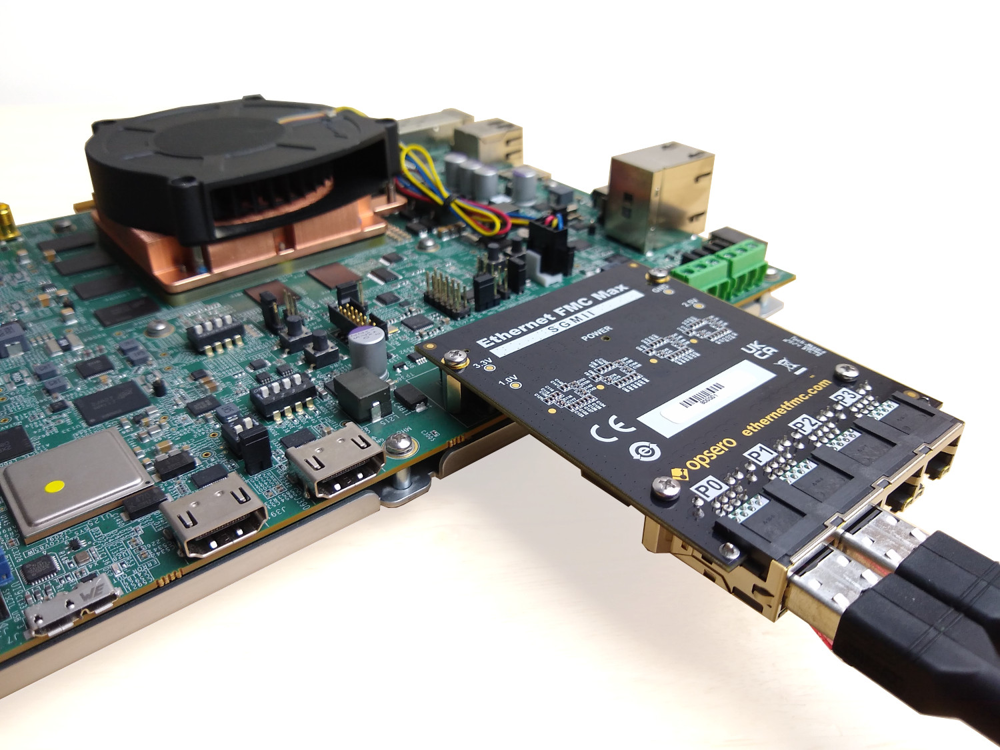

# AXI 1G Ethernet Ref Designs for Ethernet FMC Max

## Description

This project demonstrates the use of the Opsero [Ethernet FMC Max] (OP080) and it supports
several development boards for UltraScale FPGA, Zynq UltraScale+ and Versal ACAP. 
The design contains 4 AXI 1G Ethernet Subsystem blocks configured with DMAs.



Important links:

* The user guide for these reference designs is hosted here: [AXI Ethernet for Ethernet FMC Max docs](https://axieth-sgmii.ethernetfmc.com "AXI Ethernet for Ethernet FMC Max docs")
* To report a bug: [Report an issue](https://github.com/fpgadeveloper/ethernet-fmc-max-axi-eth/issues "Report an issue").
* For technical support: [Contact Opsero](https://opsero.com/contact-us "Contact Opsero").
* To purchase the mezzanine card: [Ethernet FMC Max order page](https://opsero.com/product/ethernet-fmc-max "Ethernet FMC Max order page").

## Requirements

This project is designed for version 2025.2 of the Xilinx tools (Vivado/Vitis/PetaLinux). 
If you are using an older version of the Xilinx tools, then refer to the 
[release tags](https://github.com/fpgadeveloper/ethernet-fmc-max-axi-eth/tags "releases")
to find the version of this repository that matches your version of the tools.

In order to test this design on hardware, you will need the following:

* Vivado 2025.2
* Vitis 2025.2
* PetaLinux Tools 2025.2
* [Ethernet FMC Max]
* One of the target platforms listed below
* [Xilinx Soft TEMAC license](https://ethernetfmc.com/getting-a-license-for-the-xilinx-tri-mode-ethernet-mac/ "Xilinx Soft TEMAC license")

## Target designs

This repo contains several designs that target various supported development boards and their
FMC connectors. The table below lists the target design name, the number of ports supported by the design and 
the FMC connector on which to connect the mezzanine card. Some of the target designs
require a license to generate a bitstream with the AMD Xilinx tools.

<!-- updater start -->
### FPGA designs

| Target board          | Target design      | Ports       | FMC Slot    | Standalone<br> Echo Server | PetaLinux | Vivado<br> Edition | IP<br>License |
|-----------------------|--------------------|-------------|-------------|-------|-------|-------|-------|
| [AUBoard]             | `auboard`          | 4x          | HPC         | :white_check_mark: | :x:   | Standard :free: | Required |
| [KCU105]              | `kcu105_hpc`       | 4x          | HPC         | :white_check_mark: | :x:   | Enterprise | Required |
| [VCU118]              | `vcu118_fmcp`      | 4x          | FMCP        | :white_check_mark: | :x:   | Enterprise | Required |

### Zynq UltraScale+ designs

| Target board          | Target design      | Ports       | FMC Slot    | Standalone<br> Echo Server | PetaLinux | Vivado<br> Edition | IP<br>License |
|-----------------------|--------------------|-------------|-------------|-------|-------|-------|-------|
| [UltraZed-EV Carrier] | `uzev`             | 4x          | HPC         | :white_check_mark: | :white_check_mark: | Standard :free: | Required |
| [ZCU102]              | `zcu102_hpc0`      | 4x          | HPC0        | :white_check_mark: | :white_check_mark: | Enterprise | Required |
| [ZCU102]              | `zcu102_hpc1`      | 4x          | HPC1        | :white_check_mark: | :white_check_mark: | Enterprise | Required |
| [ZCU104]              | `zcu104`           | 1x          | LPC         | :white_check_mark: | :white_check_mark: | Standard :free: | Required |
| [ZCU106]              | `zcu106_hpc0`      | 4x          | HPC0        | :white_check_mark: | :white_check_mark: | Standard :free: | Required |
| [ZCU111]              | `zcu111`           | 4x          | FMCP        | :white_check_mark: | :white_check_mark: | Enterprise | Required |
| [ZCU208]              | `zcu208`           | 4x          | FMCP        | :white_check_mark: | :white_check_mark: | Enterprise | Required |
| [ZCU216]              | `zcu216`           | 4x          | FMCP        | :white_check_mark: | :white_check_mark: | Enterprise | Required |

### Versal designs

| Target board          | Target design      | Ports       | FMC Slot    | Standalone<br> Echo Server | PetaLinux | Vivado<br> Edition | IP<br>License |
|-----------------------|--------------------|-------------|-------------|-------|-------|-------|-------|
| [VCK190]              | `vck190_fmcp1`     | 4x          | FMCP1       | :white_check_mark: | :white_check_mark: | Enterprise | Required |
| [VCK190]              | `vck190_fmcp2`     | 4x          | FMCP2       | :white_check_mark: | :white_check_mark: | Enterprise | Required |
| [VEK280]              | `vek280`           | 4x          | FMCP        | :white_check_mark: | :white_check_mark: | Enterprise | Required |
| [VHK158]              | `vhk158`           | 4x          | FMCP        | :white_check_mark: | :white_check_mark: | Enterprise | Required |
| [VMK180]              | `vmk180_fmcp1`     | 4x          | FMCP1       | :white_check_mark: | :white_check_mark: | Enterprise | Required |
| [VMK180]              | `vmk180_fmcp2`     | 4x          | FMCP2       | :white_check_mark: | :white_check_mark: | Enterprise | Required |
| [VPK120]              | `vpk120`           | 4x          | FMCP        | :white_check_mark: | :white_check_mark: | Enterprise | Required |
| [VPK180]              | `vpk180`           | 4x          | FMCP        | :white_check_mark: | :white_check_mark: | Enterprise | Required |

[AUBoard]: https://www.xilinx.com/products/boards-and-kits/1-1xj8wo9.html
[KCU105]: https://www.xilinx.com/kcu105
[VCU118]: https://www.xilinx.com/vcu118
[UltraZed-EV Carrier]: https://www.xilinx.com/products/boards-and-kits/1-1s78dxb.html
[ZCU102]: https://www.xilinx.com/zcu102
[ZCU104]: https://www.xilinx.com/zcu104
[ZCU106]: https://www.xilinx.com/zcu106
[ZCU111]: https://www.xilinx.com/zcu111
[ZCU208]: https://www.xilinx.com/zcu208
[ZCU216]: https://www.xilinx.com/zcu216
[VCK190]: https://www.xilinx.com/vck190
[VEK280]: https://www.xilinx.com/vek280
[VHK158]: https://www.xilinx.com/vhk158
[VMK180]: https://www.xilinx.com/vmk180
[VPK120]: https://www.xilinx.com/vpk120
[VPK180]: https://www.xilinx.com/vpk180
<!-- updater end -->

Notes:

1. The Vivado Edition column indicates which designs are supported by the Vivado *Standard* Edition, the
   FREE edition which can be used without a license. Vivado *Enterprise* Edition requires
   a license however a 30-day evaluation license is available from the AMD Xilinx Licensing site.

## Software

These reference designs can be driven by either a standalone application or within a PetaLinux environment. 
The repository includes all necessary scripts and code to build both environments. The table 
below outlines the corresponding applications available in each environment:

| Environment      | Available Applications  |
|------------------|-------------------------|
| Standalone       | lwIP Echo Server |
| PetaLinux        | Built-in Linux commands<br>Additional tools: ethtool, phytool, iperf3 |

## Build instructions

Clone the repo and change into its directory:
```
git clone --recursive https://github.com/fpgadeveloper/ethernet-fmc-max-axi-eth.git
cd ethernet-fmc-max-axi-eth
```

### Cross-platform build runner

All builds are driven by `build.py` at the repo root, on both Windows
(git bash) and Linux. The `build.sh` / `build.bat` shim finds a suitable
Python 3 automatically (including the one bundled with the AMD tools).
Pick a target design label from the tables above (or run `./build.sh
list`), then run the build command for the stage(s) you want — each
command builds whatever it depends on automatically and skips anything
already built. On Windows without git bash, run the same commands from
Command Prompt or PowerShell using `build.bat` (e.g. `build.bat xsa
--target <target>`).

You don't need to source the AMD tools first — the build runner finds
Vivado, Vitis and PetaLinux automatically in their standard install
locations and sets up the environment each stage needs. If your tools
are installed somewhere non-standard and the runner can't find them,
source the tool settings yourself before running the build.

#### Build the Vivado project (bitstream + XSA)

```
./build.sh xsa --target <target>
```

#### Build the standalone application

Builds the Vitis workspace and the baremetal boot file (`BOOT.BIN` or
bit file, depending on the device family):

```
./build.sh standalone --target <target>
```

#### Build PetaLinux (Linux only)

```
./build.sh petalinux --target <target>
```

#### Build everything

Builds all of the above that the target supports, then gathers the boot
images into `bootimages/*.zip`:

```
./build.sh all --target <target>
./build.sh all --target all          # every target in the repo
```

Also available: `status`, `clean`, `project` — see
`./build.sh --help`. On Windows, the PetaLinux and Yocto stages require a
Linux machine; the runner says so and prints the hand-off command. The
legacy `make` interface still works on Linux (each Makefile now wraps
`build.sh`) but is deprecated and will be removed at the next version
update.

## Contribute

We strongly encourage community contribution to these projects. Please make a pull request if you
would like to share your work:
* if you've spotted and fixed any issues
* if you've added designs for other target platforms

Thank you to everyone who supports us!

## About us

This project was developed by [Opsero Inc.](https://opsero.com "Opsero Inc."),
a tight-knit team of FPGA experts delivering FPGA products and design services to start-ups and tech companies. 
Follow our blog, [FPGA Developer](https://www.fpgadeveloper.com "FPGA Developer"), for news, tutorials and
updates on the awesome projects we work on.

[Ethernet FMC Max]: https://docs.opsero.com/op080/datasheet/overview/

