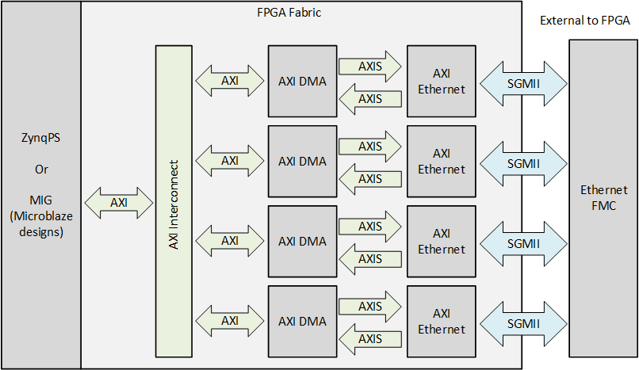

# Description

In this reference design, each port of the [Ethernet FMC Max] is connected to an AXI 1G/2.5G Ethernet Subsystem IP
which is connected to the system memory via an AXI DMA IP.

[Ethernet FMC Max]: https://ethernetfmc.com/docs/ethernet-fmc-max/overview/
