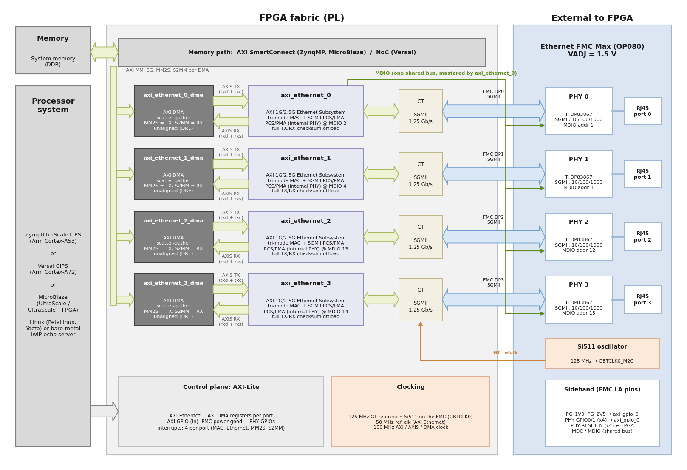
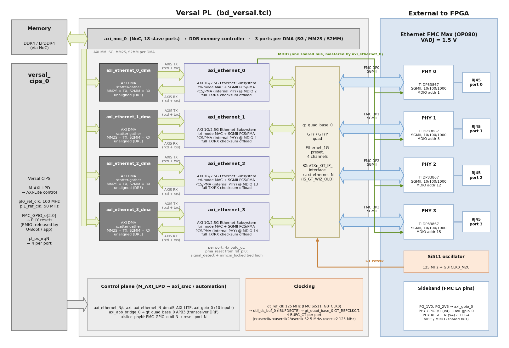
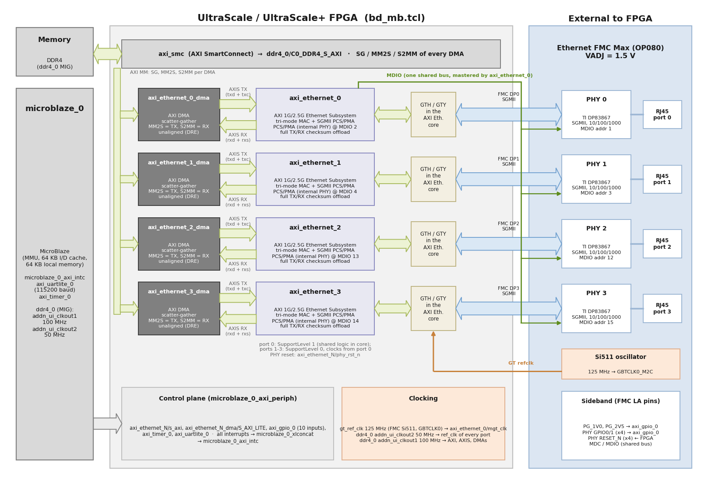

# Hardware design

This page describes the Vivado block design of the reference design: what is in it, how the
four Ethernet ports of the [Ethernet FMC Max] are connected, and how the design differs
between the three device families (Zynq UltraScale+, Versal and MicroBlaze on UltraScale /
UltraScale+ FPGAs). The block designs are created by the scripts in `Vivado/src/bd/`
(`bd_zynqmp.tcl`, `bd_versal.tcl` and `bd_mb.tcl`), and the pin assignments are in
`Vivado/src/constraints/<target>.xdc`.

## Ethernet FMC Max

The [Ethernet FMC Max] (OP080) has four Gigabit Ethernet ports. Each port has a TI DP83867
Ethernet PHY that talks to the FPGA over **SGMII**, carried on one of the FMC gigabit
transceiver lanes (port N uses lane DPN). The card also provides:

* a 125 MHz Si511 oscillator that drives the transceiver reference clock (`GBTCLK0_M2C`);
* one MDIO bus (MDC/MDIO on FMC LA pins) shared by all four PHYs;
* one active-low reset per PHY and two GPIO outputs per PHY, on FMC LA pins;
* two power-good signals (`PG_1V0`, `PG_2V5`);
* an I2C EEPROM that carries the card's VADJ requirement. The card needs **VADJ = 1.5 V**.

| Port | FMC lane | PHY MDIO address | SGMII PCS/PMA (internal PHY) MDIO address | MAC address in the Linux device tree |
|------|----------|------------------|-------------------------------------------|--------------------------------------|
| 0    | DP0      | 1                | 2                                         | `00:0a:35:00:01:22`                  |
| 1    | DP1      | 3                | 4                                         | `00:0a:35:00:01:23`                  |
| 2    | DP2      | 12               | 13                                        | `00:0a:35:00:01:24`                  |
| 3    | DP3      | 15               | 14                                        | `00:0a:35:00:01:25`                  |

The external PHY addresses and MAC addresses come from the `port-config.dtsi` device-tree
overlays of the Linux BSPs; the PCS/PMA addresses are the `PHYADDR` setting of each AXI
Ethernet core in the block design. All eight devices sit on the same MDIO bus.

```{note}
The ZCU104 has an LPC FMC connector, which carries only one gigabit transceiver lane. The
`zcu104` target therefore implements **port 0 only**; the resets of the three unused PHYs
are held low so that those PHYs stay in reset.
```

## Overview



The same structure is used on every target. For each port of the Ethernet FMC Max:

* an **AXI 1G/2.5G Ethernet Subsystem** (`axi_ethernet_N`) configured for SGMII: tri-mode
  (10/100/1000) Ethernet MAC plus SGMII PCS/PMA, using one FPGA transceiver at
  1.25 Gb/s, with full TX and RX checksum offload. The tri-mode MAC requires the AMD
  Tri-Mode Ethernet MAC (TEMAC) IP license (see [Requirements](requirements));
* an **AXI DMA** (`axi_ethernet_N_dma`) in scatter-gather mode with unaligned transfers
  (data realignment engine) enabled, connected to the MAC by AXI-Stream (TX data + TX
  control, RX data + RX status);
* the DMA's three AXI memory-mapped masters (scatter-gather, MM2S, S2MM) connect to the
  system memory;
* four interrupts per port (MAC, Ethernet core, DMA MM2S, DMA S2MM) go to the processor.

`axi_ethernet_0` is the MDIO master for the whole card: Linux and the standalone application
reach all four PHYs through it. An **AXI GPIO** (`axi_gpio_0`, 10 inputs) reads the two
power-good signals and the two GPIO outputs of each PHY.

## Zynq UltraScale+ designs


* **Processor:** the Zynq UltraScale+ PS (`zynq_ultra_ps_e_0`) with the board preset applied.
  `M_AXI_HPM0_FPD` drives the AXI-Lite registers; the DMAs reach the PS DDR through an AXI
  SmartConnect (`axi_smc`) into `S_AXI_HP0_FPD`. The DMAs can also access the OCM.
* **Clocks:** `pl_clk0` (100 MHz) clocks the AXI-Lite, AXI-Stream, DMA and SmartConnect logic;
  `pl_clk1` (50 MHz) is the `ref_clk` of the AXI Ethernet cores. On the UltraZed-EV the 50 MHz
  clock is sourced from the IOPLL. The 125 MHz transceiver reference clock comes from the
  FMC (`gt_ref_clk`).
* **Shared logic:** port 0's AXI Ethernet core is built with its shared logic (transceiver
  common block and clocking) inside the core; ports 1 to 3 take their transceiver clocks and
  resets from port 0. The transceiver site of each port is set per target in
  `Vivado/src/bd/gt_locs.tcl`.
* **PHY resets:** driven by the `phy_rst_n` output of each AXI Ethernet core.
* **Interrupts:** concatenated into `pl_ps_irq0` and `pl_ps_irq1`.

## Versal designs



* **Processor:** the Versal CIPS (`versal_cips_0`). `M_AXI_LPD` drives the AXI-Lite registers;
  the DMAs reach DDR through the NoC (`axi_noc_0`, three NoC ports per DMA).
* **Transceivers:** a `gt_quad_base` (GTY, or GTYP on VPK120/VPK180/VHK158/VEK280)
  configured with the Ethernet 1G preset on all four channels, programmed through an AXI
  APB bridge. Each AXI Ethernet core connects to its channel through the GT interface
  bundles, with four `BUFG_GT` clock buffers per port.
* **Clocks:** `pl0_ref_clk` (100 MHz) for AXI-Lite, AXI-Stream and DMA logic; `pl1_ref_clk`
  (50 MHz) as the AXI Ethernet `ref_clk`; the 125 MHz FMC reference clock enters through an
  `IBUFDSGTE` (`util_ds_buf_0`).
* **PHY resets:** driven by PMC GPIO outputs 0 to 3 (EMIO). They are **not** released by the
  hardware; software must release them. The standalone application does it in its lwIP
  adapter (`PHY reset released (PMC GPIO EMIO bits 0-3 HIGH)` on the console); the Linux
  BSPs for VCK190, VMK180, VPK120, VPK180 and VEK280 do it in the U-Boot boot command (see
  [Yocto](yocto) and [PetaLinux](petalinux)).
* **VADJ:** on most Versal boards the FMC VADJ rail must be switched on by software; the
  standalone application and the Linux BSPs do this (VEK280 enables VADJ by default).

## MicroBlaze designs



* **Processor:** a MicroBlaze (`microblaze_0`) with MMU, 64 KB instruction/data caches, 64 KB
  of local memory, an AXI interrupt controller, an AXI UART Lite (115200 baud) and an AXI Timer.
* **Memory:** the DDR4 controller (`ddr4_0`); the DMAs reach it through an AXI SmartConnect.
* **Clocks:** the DDR4 controller's additional user clocks: 100 MHz for the AXI and AXI-Stream
  logic, 50 MHz for the AXI Ethernet `ref_clk`.
* **Shared logic and PHY resets:** as on Zynq UltraScale+ (port 0 holds the shared logic,
  `phy_rst_n` drives the PHY resets).
* The MicroBlaze targets (AUBoard, KCU105, VCU118) are supported by the standalone echo server
  only.

## Regenerating the diagrams

The diagrams on this page are generated by `docs/source/images/gen_block_diagram.py`
(matplotlib). If you change the block design, update the script and run it:

```
python3 docs/source/images/gen_block_diagram.py
```

To see the block design itself, build the Vivado project (`./build.sh project --target <target>`)
and open `Vivado/<target>/<target>.xpr` in Vivado.

[Ethernet FMC Max]: https://docs.opsero.com/op080/datasheet/overview/
