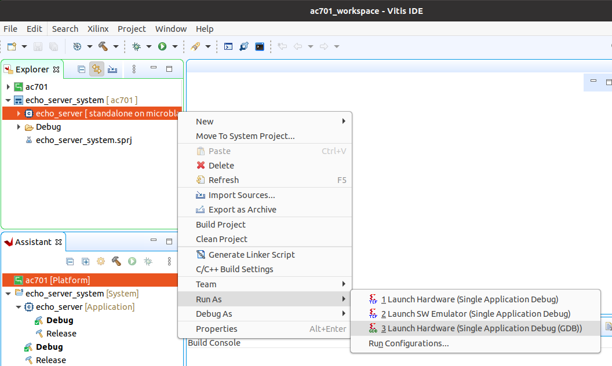

# Stand-alone lwIP Echo Server

The standalone (bare-metal) application is the quickest way to check the hardware: it brings one
port of the [Ethernet FMC Max] up, gets an IP address, and echoes back any TCP data sent to it.
It is available for every target, including the MicroBlaze targets, and it can be built and run
on Windows as well as Linux.

The application is the lwIP echo-server template that ships with Vitis, layered with local
modifications needed to drive the TI DP83867 PHYs of the Ethernet FMC Max over SGMII. The
`Vitis/` directory of the repository contains a Vitis Python build driver
(`py/build-vitis.py`, configured by `py/args.json`) that creates the workspace, registers a local
software repository containing the patched lwIP sources (from the repo's `EmbeddedSw/`
directory), and builds the application.

## Requirements

* Vivado 2025.2 and Vitis 2025.2 (Windows or Linux), with the licences listed in
  [Requirements](requirements).
* The [Ethernet FMC Max] fitted on the FMC connector of your target (see the target tables in
  the [build instructions](build_instructions.md#target-designs)).
* A USB cable for the board's USB-UART, and the JTAG cable (on most AMD boards both are on the
  same USB connector).
* For the Zynq UltraScale+ and Versal targets, optionally an SD card to boot from.
* An Ethernet cable from the port under test to a PC, or to a router/switch with a DHCP server
  on the same network as the PC.

## Build

```
./build.sh standalone --target <target>
```

This builds the Vivado project and XSA first if needed, creates the Vitis workspace in
`Vitis/<target>_workspace`, builds the application and packages the boot files into
`Vitis/boot/<target>/`:

| Device family | Files in `Vitis/boot/<target>/` |
|---------------|----------------------------------|
| Zynq UltraScale+, Versal | `BOOT.BIN` (boot loader, bitstream/PDI and the echo server) |
| MicroBlaze (AUBoard, KCU105, VCU118) | `axieth.bit` (bitstream) and `echo_server.elf` (application) |

`./build.sh package --target <target>` (or `./build.sh all`) also zips these files into
`bootimages/ethernet-fmc-max-axi-eth_<target>_standalone-2025-2.zip`.

## Run the application

Open a terminal on the board's USB-UART first (115200 baud, 8N1; see [UART settings](#uart-settings))
so that you see the application's output from the start.

### Zynq UltraScale+ and Versal: boot from SD card

1. Format an SD card with a single FAT32 partition and copy `Vitis/boot/<target>/BOOT.BIN` onto
   it.
2. Insert the card, set the board's boot-mode switches to SD boot (see
   [Boot PetaLinux](petalinux.md#boot-petalinux) for the per-board settings) and power on.

### Zynq UltraScale+ and Versal: run from Vitis over JTAG

1. Launch the Vitis GUI and select the `Vitis/<target>_workspace` directory as the workspace.
2. Set the board's boot-mode switches to JTAG (see [Boot via JTAG](petalinux.md#setup-hardware)),
   connect the JTAG cable and power on.
3. In the Vitis Explorer panel, expand the System project (postfix `_system`), right-click the
   `echo_server` application and select **Run As → Launch on Hardware (Single Application
   Debug (GDB))**.



The run configuration programs the device, then loads and runs the application.

### MicroBlaze targets (AUBoard, KCU105, VCU118)

Program the bitstream and download the application over JTAG, either from the Vitis GUI as
above, or with the Xilinx System Debugger (`xsdb`, installed with Vitis):

```
xsdb
xsdb% connect
xsdb% fpga Vitis/boot/<target>/axieth.bit
xsdb% targets -set -filter {name =~ "MicroBlaze #0*"}
xsdb% dow Vitis/boot/<target>/echo_server.elf
xsdb% con
```

## Expected output

The UART output should look like this (ZCU106, port 0 cabled to a router with DHCP):

```
Zynq MP First Stage Boot Loader 
Release 2025.2   Apr  8 2026  -  19:29:19
PMU-FW is not running, certain applications may not be supported.


-----lwIP TCP echo server ------
TCP packets sent to port 6001 will be echoed back
Targeting PORT0 of the Ethernet FMC Max, External PHY address 1
Start TI PHY autonegotiation
Waiting for Link to be up 
Auto negotiation completed for TI PHY
Start PHY autonegotiation 
Waiting for PHY to complete autonegotiation.
autonegotiation complete 
auto-negotiated link speed: 1000
Board IP: 192.168.2.72
Netmask : 255.255.255.0
Gateway : 192.168.2.1
TCP echo server started @ port 7
```

The assigned board IP will vary. Check that:

* `Targeting PORT0 ... External PHY address 1` names the port you have cabled;
* `auto-negotiated link speed` matches your link partner (1000, 100 or 10);
* a `Board IP` is printed and the server starts on port 7.

On Versal targets you will also see a PLM banner, a `VADJ: 1.5V enabled successfully` line ahead
of the echo-server header, and lines reporting the PHY reset being asserted and released.
`vadj_enable(VADJ_1V5)` runs at the top of `main()` to switch the FMC VADJ rail on (to 1.5 V)
through the board's power controller, and the PHY resets (driven from PMC GPIO on Versal) are
then pulsed by the patched lwIP adapter (see `Vitis/common/src/vadj.c` and
`EmbeddedSw/ThirdParty/sw_services/lwip220_v1_3/`). On the VEK280, VADJ is already on and
`vadj_enable` does nothing.

## UART settings

To receive the UART output of this standalone application, connect the USB-UART of the
development board to your PC and run a console program such as [Putty] (Windows) or
`screen`/`minicom` (Linux). All targets use 115200 baud, 8N1 (the MicroBlaze AXI UART Lite is
also configured for 115200 in `Vivado/src/bd/bd_mb.tcl`).

## IP address

By default, the echo server requests an IP address from a DHCP server. Once the IP address is
obtained, it is printed on the UART console.

If the echo server is connected directly to a PC, the DHCP request times out (`DHCP Timeout`)
and the echo server uses the default IP address **192.168.1.10**. Configure the PC's NIC with a
fixed address on the same subnet, for example 192.168.1.20, netmask 255.255.255.0.

## Test the echo server

### Ping

From a PC on the same network (or directly connected), ping the address printed on the console:

```
ping 192.168.1.10
```

### Connect with telnet

Connect to the echo service (TCP port 7) and type a few characters; each line is sent back:

```
telnet 192.168.1.10 7
```

## Change the target port

The echo server uses one Ethernet port at a time, port 0 by default. To use another port, edit
the `ETHERNET_PORT` define in `Vitis/<target>_workspace/echo_server/src/platform_config.h.in`:

* ``0``: Ethernet FMC Max port 0
* ``1``: Ethernet FMC Max port 1
* ``2``: Ethernet FMC Max port 2
* ``3``: Ethernet FMC Max port 3

then rebuild the application in Vitis and run it again (for SD boot, regenerate the boot image
in Vitis). The edit is made in the generated workspace, so it is lost if the workspace is
deleted and rebuilt. The `zcu104` target has only port 0.

## Troubleshooting

* **`Waiting for Link to be up` never completes:** check the cable and the link partner, that
  the card is on the right FMC connector for the target, and that VADJ is on (see
  [Troubleshooting](troubleshooting.md#ports-not-working)).
* **`DHCP Timeout` although a router is connected:** the port that is cabled is not the one the
  application targets (`Targeting PORTn`); move the cable or change `ETHERNET_PORT`.
* **No UART output:** check the COM port (boards with several UART channels use the first one
  for the console) and the boot-mode switches.

[Ethernet FMC Max]: https://docs.opsero.com/op080/datasheet/overview/
[Putty]: https://www.putty.org
